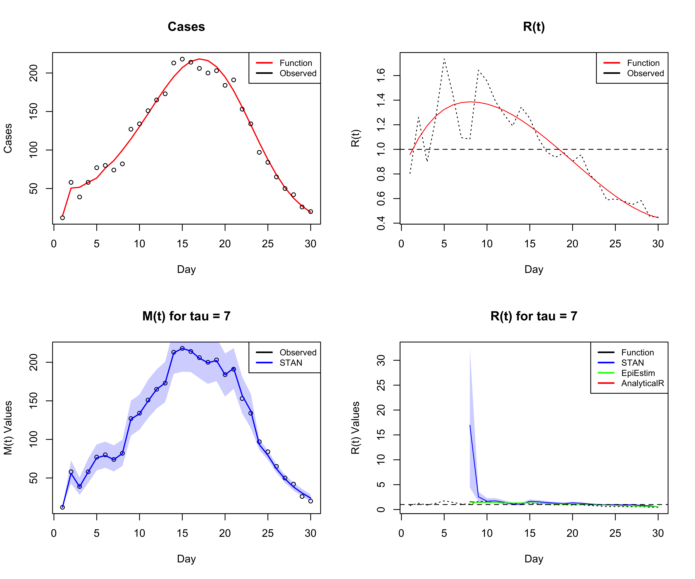

# Sliding window

Bayesian sliding window for R(t) work in 1 dimension

use in order:
* `01_simulate_data.R`
* `02_run_stan.R`
* `03_extract_output.R`
* `04_plot.R`

Doing it this way means you can get a posterior distribution for M(t)!

### Differences:
* the window approach. Originally Zhenwei was doing M windows, but we did R windows
* is R calculated before or after transfer? changes interpretation
* runs quickly
* sigma actually is a function of data now!
* the warmup / cooldown sliding windows
* back imputation: Right now the way this is fixed is just imputing what the M[0] value was. I tried implementing the exponential growth model from EpiEstim for back-calculation but it didn't quite work. I think its because its being applied in the serial interval part of the calculation. I think w would have to come into play but imputing the original value seems to work well enough

### To Fix
* I tried to implement a reporting delay tail ad-hoc but it needs to be done officially

### next steps
* re-create Zhenwei paper figure 1
* incorporate a reporting delay distribution
* make it software? Excel Julia AWS?
* write a different paper talking about this method?
* use this to solve one of KGs issues related to downscaling?

