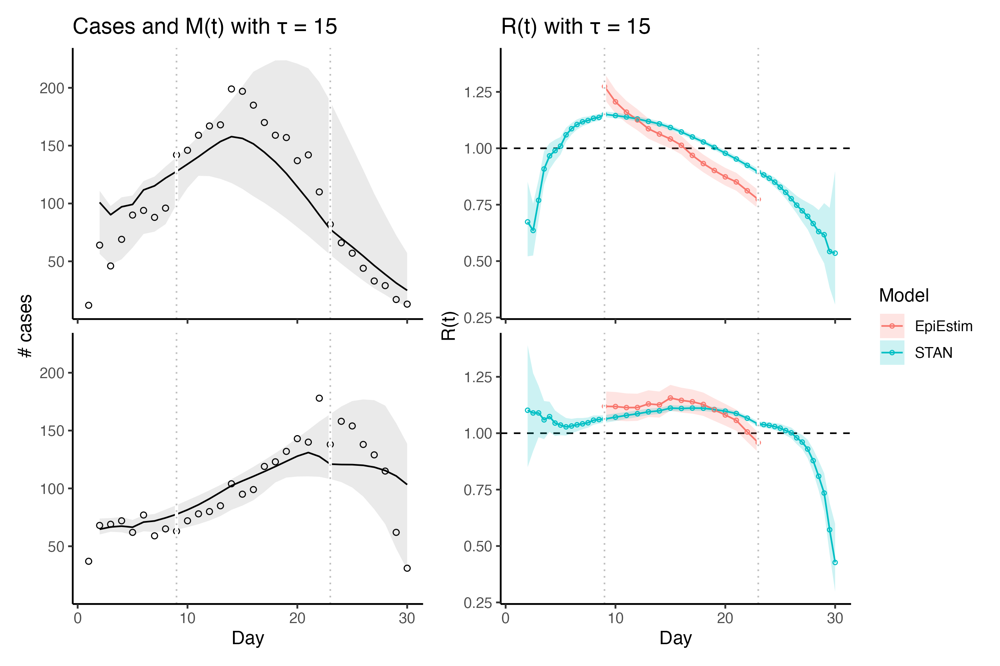

# Sliding window

Bayesian sliding window for R(t) work in 1 dimension

Latest run file:
* `02_run_stan_2d.R`

Doing it this way means you can get a posterior distribution for M(t)!

### Differences:
* the window approach. Originally Zhenwei was doing M windows, but we did R windows. This actually changes things a lot. which is the correct interpretation? Even with Tau = 5, you can get some spikiness because windowed R is constrained by groups of M(t) that are likely to result in the Y(t). Rather than how Zhenwei wrote it, sequences of M(t) will result in similar Y[n], which then influences daily estimates of R(t). The problem was though that if STAN had the option to fit a daily R[n] it was always fit to the day.
* Another difference is that Zhenwei ran and averaged results over many simulations (right?), whereas this code is from one simulation. 
* is R calculated before or after transfer? changes interpretation
* runs quickly (3000 iterations, no chain depth) and converges. even for the simulated data it only takes 6hrs on the SCC. I think its because if R has dimension [n] it will Always pick the one that maximzes, so it will always be curve fitting in that case. 
* sigma actually is a function of data now!
* the warmup / cooldown sliding windows
* back imputation: Right now the way this is fixed is just imputing what the M[0] value was. I tried implementing the exponential growth model from EpiEstim for back-calculation but it didn't quite work. I think its because its being applied in the serial interval part of the calculation. I think w would have to come into play but imputing the original value seems to work well enough

### To Fix
* I tried to implement a reporting delay tail ad-hoc but it needs to be done officially

### next steps
* re-create Zhenwei paper figure 1
  * seems like this runs in about 6 hours!
* incorporate a reporting delay distribution
* make it software? Excel Julia AWS?
* [Convert stan to Julia](https://discourse.julialang.org/t/implementation-of-nuts-translating-stan-model-to-julia-juliaconnector/74143)
* Oo what about an API? -- and basically we could roll out a dashboard for each use case depending on what people send in. but each person could then customize
* this would also make it easy to test -- right also if XYZ package doesn't need a paper, why do we?
* What's best for InsightNEt? for BU SPH? for CWM? Right if our task is to make a tool, why would we write a paper? who cares how it performs?
* write a different paper talking about this method?
* use this to solve one of KGs issues related to downscaling?

