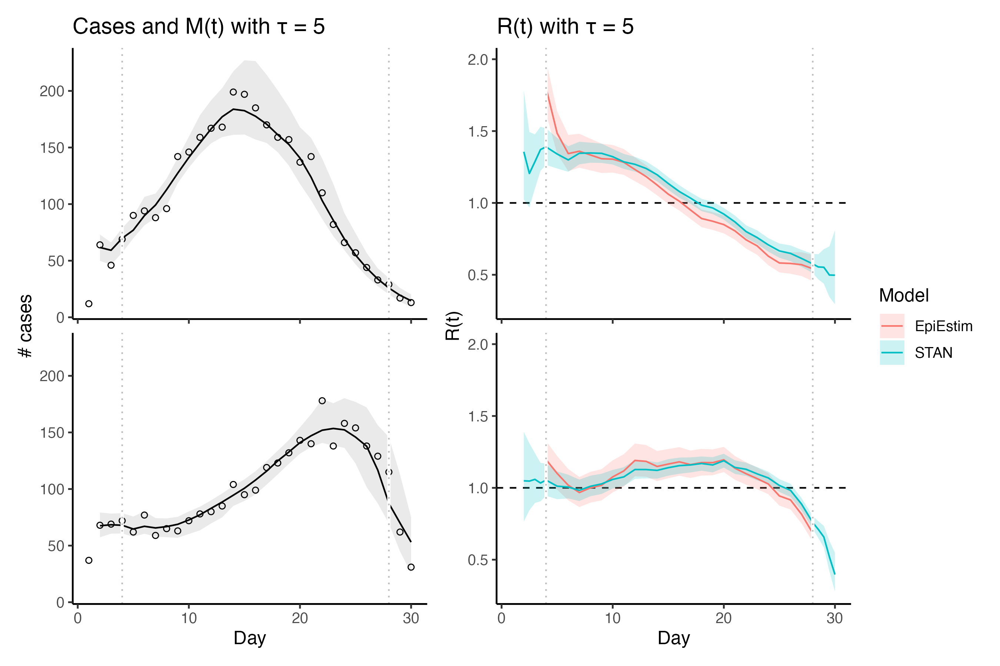

# Sliding window

Bayesian sliding window for R(t) work in 1 dimension

use in order:
* `01_simulate_data.R`
* `02_run_stan.R`
* `03_extract_output.R`
* `04_plot.R`

Essentially this is one step beyond the Cori 2013 method. Except you can't predict the posterior M(t) with Cori 2013.

### next steps
* adding the J dimension back in -- confirm that this works if P is diagonal ones
* does changing R to be Gamma change the fit?
* do `Flu2009`
* also implement back-calcuation

